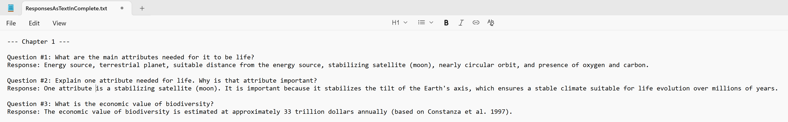
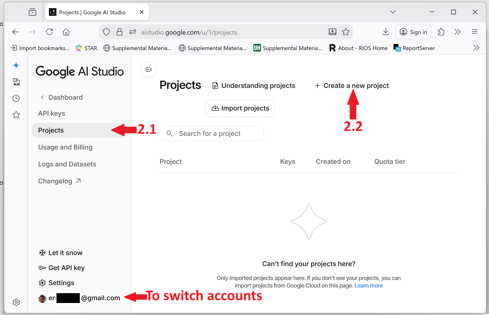
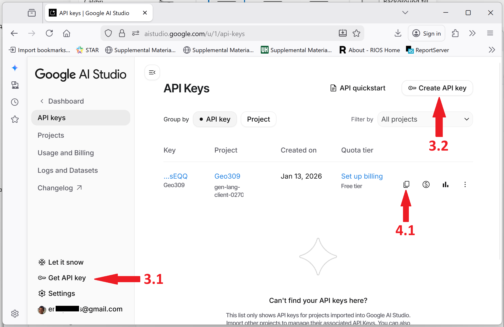
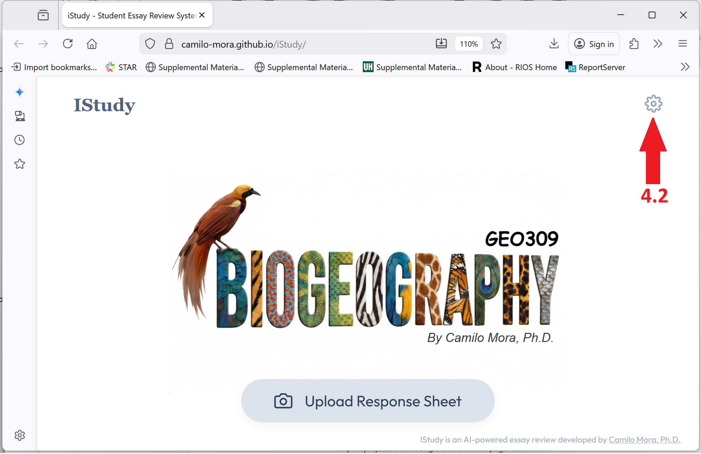

# Welcome {-}


```{block2, type='rmdtip'}
**LEARNING OBJECTIVES**
At the end of the class, students are expected to describe spatial patterns on the number of species, body size and abundance on Earth, as well as the driving forces behind those patterns.
```


```{js, echo = FALSE}
title=document.getElementById('header');
title.innerHTML = '' + title.innerHTML
```


This course explores current ideas and theory regarding the patterns and mechanisms driving biodiversity on Earth. 

Student will first gain basic understanding of general concepts about biodiversity, and then dive into current knowledge about global scale patterns on the distribution of species, their body sizes and abundances.

We will also discuss how environmental, ecological and anthropocentric variables have shaped such patterns of life on Earth.

This course consists of a number of weekly lectures covering different aspects about the diversity of life on Earth. Each lecture has been recorded and is provided in the chapters below. Each chapter is accompanied with the slides of the lectures, and a set questions you need to answer after watching the lectures.

[Sillabus](https://github.com/Camilo-Mora/GEO309/raw/main/main/GEOG309_Sillabus.doc) <br>


# Your Roadmap in this Class {- #roadmap-style}


### **Phase A: Submitting Weekly Q&A** {-}

<span style="font-size: 0.8em;"> *This determines your grade up to a **B+**.  Each week, by the end of Sunday, you have to submit the Q&A report of a chapter. You are welcome to submit more if you wish to work ahead. I expect that you would expend quality time in this phase, which is the reason why I gave such a high proportion of the grade to it.*</span>


*   **One-Time Setup:** Get your Google API Key and save it in the iStudy App (Instructions below). 


* **The Workflow:**
    1.  **Chapter Selection:** This course has 13 chapters **numbered** in the Table of Contents on the left sidebar (e.g., **1:**, **2:**); click the current week's chapter.
    2.  **Get Questions:** On the chapter page, click the **"Exam questions"** link to see the specific list of questions you need to answer.
    3.  **Watch & Answer:** Watch the lecture video **located on that same page** and **collect** the answers as you watch. The lecture contains all the information needed to respond to the questions.
    4.  **Submit to iStudy:** Save your answers as a file (e.g., Text, or photo of your handwritten responses). Upload that file to the [iStudy App](https://camilo-mora.github.io/GEO309/istudy-weekly-essay-delivery-app.html). The app will provide feedback and generate a revised version of your responses for your records.

<br>

*   **Submission Rules:**
    *   **Single File Only:** You can only upload **one file** per chapter (containing all answers for the given chapter).
    *   **File Type:** A photo of your handwriting OR a `.txt` file. 
        *   *If using Word/Excel: Click "Save As" and select "Plain Text (.txt)" before uploading.*
    *   **Required Labeling:** Your file **must** clearly state the Chapter Number and Question Numbers. 

<br>

{style="display: block; margin: 0 auto; width: 120%;"}

<p style="text-align: center; color: gray; font-size: 0.9em;">*Example of the required formatting for your submissions.*</p>

<br>

> 🚨 **Critical:** Budget **60 minutes** of continuous time to deliver your essays. Due to privacy issues, the app does not save progress; if you stop, you must start from the beginning of that chapter.

<br>

<hr style="border: 0.5px solid #ddd;">

<br>

### **Phase B: Submitting Exam Videos** {-}

*The exam is voluntary to reach the **A territory** (A-, A, or A+). These videos are due any time after you finish Phase A and before the last day of class.*


*   **The Workflow:**
    1.  **Preparation:** Study your **Revised Response Reports** from Phase A until you master the logic.
    2.  **Record (One Video Per Chapter):**
        *   Film yourself responding to **all** questions for that chapter. You choose which chapters to record.
        *   **Format:** Facing the camera, state the question clearly, then provide the response from memory.
        *   **Integrity:** No notes allowed; this is an oral proof of mastery. If I suspect cheating, you may be asked to re-do the videos.
        *   **Validation:** If your responses are incorrect, it may indicate Phase A was not completed properly, and you may be asked to provide evidence of your weekly essays.

<br>

*   **Delivery:**
    1.  **Upload:** Post your videos to YouTube (Public or Unlisted).
    2.  **Email:** Send the URL links to Dr. Mora.
        *   **Subject Line:** `GEO309-[YOUR LAST NAME]-Final exam`
        *   **Email Body:** State clearly what you sent and the grade you aim for. For example, "I want an A+, so I am submitting 10 videos showing my mastery of 10 chapters."

<br>


# 📝 Grading {-}


Your grade in this class is transparent and proportional to the content you master in this class. It follows the image below. 

To read the image, check for instance, that to get an B+ you need to deliver all 13 weekly essays via the app, you may choose a B and that requires to submit at least 12 chapters, etc.

If you choose to take the exam, you need to submit excellent videos with all the responses for six chapter for an A-, eight chapters for an A, and 10 chapters for an A+. 

Each week as you deliver your essays, the app will display your current grade.


## 🔑 How to Get Your Google API Key {-}


To use the iStudy app, you need a free Google AI API key. Follow these steps: 

```{block2, type='rmdtip'}
**Caution:** 
  
As students start to use the app, we have come across some compatibility issues you need to be aware of:

*Restricted Gmail account*: If your Gmail account does not display the option to get an API key, it is very likely your account is from a restricted country. I am certain Gmail accounts created in the USA offer these keys. UH email does not work.


*Mac browser problem*: if you get a warning like "Suspicius request", use a different browser. Some Apple products are being flaged by Google.
```


You will do this only once, as the key(s) get saved in your local browser.


1.  **Go to Google AI Studio:**
    Visit [aistudio.google.com](https://aistudio.google.com/) and log in with your **personal Gmail account** (UH emails do not work).

2.  **Create a Project:**
    *   2.1 Click on **"Projects"** (top left).
    *   2.2 Click **"+ Create a new project"**.
    *   On the popup window, name your project **"GEO309"** and click **"Create project"**.


3.  **Generate the Key:**
    *   3.1 Click `Get API key` (bottom left button).
    *   3.2 Click `Create API key`.
    *   On the popup window, select the **GEO309** project you just created.
    *   Click **"Create key"**.


4.  **Copy & Paste:**
    *   Copy the generated key string.
    *   4.2 Go to the iStudy app, click the **Settings (⚙️)** icon, and paste your key, and save it.



> **Note:** Ideally, generate **2 or 3 keys** using different personal Google accounts and add them all to the app settings. This prevents "Quota Limit" errors during long review sessions. 


# Launch iStudy App {-}

After you have watched a video for a given chapter, and collected all your responses in an image or text file, load them in this app:

Expect to work at least 60 minutes reviewing your responses for any given chapter. The app cannot save data so if you do not finish submitting all your work in one go, you will have to start from scratch, so please be warned of this time requirement.


[](https://camilo-mora.github.io/iStudy/){target="_blank"}


# 1: Basic concepts {-}
[Slides](https://github.com/Camilo-Mora/GEO309/raw/main/main/Lecture 01_Basic concepts.pptx) <br>
[Exam questions](https://github.com/Camilo-Mora/GEO309/raw/main/main/ExamQuestions_01.xlsx)
<center>
<iframe width="560" height="315" src="https://www.youtube.com/embed/-S1rNCFUhYk" title="YouTube video player" frameborder="0" allow="accelerometer; autoplay; clipboard-write; encrypted-media; gyroscope; picture-in-picture" allowfullscreen></iframe>
[Transcript](https://github.com/Camilo-Mora/GEO309/raw/main/main/Transcript_Lecture_01.txt)
</center>


# 2: Speciation and extinction {-}
[Slides](https://github.com/Camilo-Mora/GEO309/raw/main/main/Lecture 02_ Speciation and Extinciton.pptx) <br>
[Exam questions](https://github.com/Camilo-Mora/GEO309/raw/main/main/ExamQuestions_02.xlsx)
<center>
<iframe width="560" height="315" src="https://www.youtube.com/embed/jofK3KzfSps" title="YouTube video player" frameborder="0" allow="accelerometer; autoplay; clipboard-write; encrypted-media; gyroscope; picture-in-picture" allowfullscreen></iframe>
[Transcript](https://github.com/Camilo-Mora/GEO309/raw/main/main/Transcript_Lecture_02.txt)
</center>

# 3: Taxonomy, systematics, and phylogenies {-}
[Slides](https://github.com/Camilo-Mora/GEO309/raw/main/main/Lecture 03_ Taxonomy.pptx) <br>
[Exam questions](https://github.com/Camilo-Mora/GEO309/raw/main/main/ExamQuestions_03.xlsx)
<center>
<iframe width="560" height="315" src="https://www.youtube.com/embed/P0MLm9uAunA" title="YouTube video player" frameborder="0" allow="accelerometer; autoplay; clipboard-write; encrypted-media; gyroscope; picture-in-picture" allowfullscreen></iframe>
[Transcript](https://github.com/Camilo-Mora/GEO309/raw/main/main/Transcript_Lecture_03.txt)
</center>

# 4: Human evolution {-}
[Slides](https://github.com/Camilo-Mora/GEO309/raw/main/main/Lecture 04_Human evolution.pptx) <br>
[Exam questions](https://github.com/Camilo-Mora/GEO309/raw/main/main/ExamQuestions_04.xlsx)
<center>
<iframe width="560" height="315" src="https://www.youtube.com/embed/OHUJPdaGtIg" title="YouTube video player" frameborder="0" allow="accelerometer; autoplay; clipboard-write; encrypted-media; gyroscope; picture-in-picture" allowfullscreen></iframe>
[Transcript](https://github.com/Camilo-Mora/GEO309/raw/main/main/Transcript_Lecture_04.txt)
</center>


# 5: Biogeographical regions {-}
[Slides](https://github.com/Camilo-Mora/GEO309/raw/main/main/Lecture 05 Biogeographical Regions.pptx) <br>
[Exam questions](https://github.com/Camilo-Mora/GEO309/raw/main/main/ExamQuestions_05.xlsx)
<center>
<iframe width="560" height="315" src="https://www.youtube.com/embed/NzhqUU46_GE" title="YouTube video player" frameborder="0" allow="accelerometer; autoplay; clipboard-write; encrypted-media; gyroscope; picture-in-picture" allowfullscreen></iframe>
[Transcript](https://github.com/Camilo-Mora/GEO309/raw/main/main/Transcript_Lecture_05.txt)
</center>


# 6: Geographic range {-}
[Slides](https://github.com/Camilo-Mora/GEO309/raw/main/main/Lecture 06 Geographical range.pptx) <br>
[Exam questions](https://github.com/Camilo-Mora/GEO309/raw/main/main/ExamQuestions_06.xlsx)
<center>
<iframe width="560" height="315" src="https://www.youtube.com/embed/4Mtxaj7tAKg" title="YouTube video player" frameborder="0" allow="accelerometer; autoplay; clipboard-write; encrypted-media; gyroscope; picture-in-picture" allowfullscreen></iframe>
[Transcript](https://github.com/Camilo-Mora/GEO309/raw/main/main/Transcript_Lecture_06.txt)
</center>


# Species richness  {-}

## 7: Patterns {-}
[Slides](https://github.com/Camilo-Mora/GEO309/raw/main/main/Lecture 07 Patterns in species richness.pptx) <br>
[Exam questions](https://github.com/Camilo-Mora/GEO309/raw/main/main/ExamQuestions_07.xlsx)
<center>
<iframe width="560" height="315" src="https://www.youtube.com/embed/XkqI4zNP2VI" title="YouTube video player" frameborder="0" allow="accelerometer; autoplay; clipboard-write; encrypted-media; gyroscope; picture-in-picture" allowfullscreen></iframe>
[Transcript](https://github.com/Camilo-Mora/GEO309/raw/main/main/Transcript_Lecture_07.txt)
</center>


## 8: Processes {-}
[Slides](https://github.com/Camilo-Mora/GEO309/raw/main/main/Lecture 08 Processes in species richness.pptx) <br>
[Exam questions](https://github.com/Camilo-Mora/GEO309/raw/main/main/ExamQuestions_08.xlsx)
<center>
<iframe width="560" height="315" src="https://www.youtube.com/embed/EJpzKQ8F9m4" title="YouTube video player" frameborder="0" allow="accelerometer; autoplay; clipboard-write; encrypted-media; gyroscope; picture-in-picture" allowfullscreen></iframe>
[Transcript](https://github.com/Camilo-Mora/GEO309/raw/main/main/Transcript_Lecture_08.txt)
</center>


# Body size  {-}

## 9: Processes {-}
[Slides](https://github.com/Camilo-Mora/GEO309/raw/main/main/Lecture 09 Processes in body size.pptx) <br>
[Exam questions](https://github.com/Camilo-Mora/GEO309/raw/main/main/ExamQuestions_09.xlsx)
<center>
<iframe width="560" height="315" src="https://www.youtube.com/embed/CYr3yVFnMN4" title="YouTube video player" frameborder="0" allow="accelerometer; autoplay; clipboard-write; encrypted-media; gyroscope; picture-in-picture" allowfullscreen></iframe>
[Transcript](https://github.com/Camilo-Mora/GEO309/raw/main/main/Transcript_Lecture_09.txt)
</center>


## 10: Patterns {-}
[Slides](https://github.com/Camilo-Mora/GEO309/raw/main/main/Lecture 10 Processes in body size.pptx) <br>
[Exam questions](https://github.com/Camilo-Mora/GEO309/raw/main/main/ExamQuestions_10.xlsx)
<center>
<iframe width="560" height="315" src="https://www.youtube.com/embed/AYRft23ied4" title="YouTube video player" frameborder="0" allow="accelerometer; autoplay; clipboard-write; encrypted-media; gyroscope; picture-in-picture" allowfullscreen></iframe>
[Transcript](https://github.com/Camilo-Mora/GEO309/raw/main/main/Transcript_Lecture_10.txt)
</center>


# 11: Abundance {-}
[Slides](https://github.com/Camilo-Mora/GEO309/raw/main/main/Lecture 11 Abundance.pptx) <br>
[Exam questions](https://github.com/Camilo-Mora/GEO309/raw/main/main/ExamQuestions_11.xlsx)
<center>
<iframe width="560" height="315" src="https://www.youtube.com/embed/FJpxv-YBAGs" title="YouTube video player" frameborder="0" allow="accelerometer; autoplay; clipboard-write; encrypted-media; gyroscope; picture-in-picture" allowfullscreen></iframe>
[Transcript](https://github.com/Camilo-Mora/GEO309/raw/main/main/Transcript_Lecture_11.txt)
</center>


# 12: Ecosystem functioning {-}
[Slides](https://github.com/Camilo-Mora/GEO309/raw/main/main/Lecture 12 Ecosystem functioning.pptx) <br>
[Exam questions](https://github.com/Camilo-Mora/GEO309/raw/main/main/ExamQuestions_12.xlsx)
<center>
<iframe width="560" height="315" src="https://www.youtube.com/embed/gX6XsgOka5w" title="YouTube video player" frameborder="0" allow="accelerometer; autoplay; clipboard-write; encrypted-media; gyroscope; picture-in-picture" allowfullscreen></iframe>
[Transcript](https://github.com/Camilo-Mora/GEO309/raw/main/main/Transcript_Lecture_12.txt)
</center>


# 13: The future of biodiversity {-}
[Slides](https://github.com/Camilo-Mora/GEO309/raw/main/main/Lecure 13 The future of biodiversity.pptx) <br>
[Exam questions](https://github.com/Camilo-Mora/GEO309/raw/main/main/ExamQuestions_13.xlsx)
<center>
<iframe width="560" height="315" src="https://www.youtube.com/embed/X0_Dq1LuAq8" title="YouTube video player" frameborder="0" allow="accelerometer; autoplay; clipboard-write; encrypted-media; gyroscope; picture-in-picture" allowfullscreen></iframe>
[Transcript](https://github.com/Camilo-Mora/GEO309/raw/main/main/Transcript_Lecture_13.txt)
</center>

