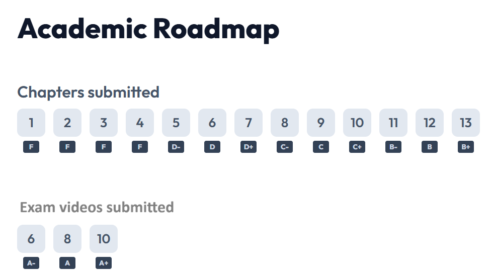

# Welcome {-}

Welcome to Introduction to BioGeography.


```{js, echo = FALSE}
title=document.getElementById('header');
title.innerHTML = '' + title.innerHTML
```


This course explores current ideas and theory regarding the patterns and mechanisms driving biodiversity on Earth. 

Student will first gain basic understanding of general concepts about biodiversity, and then dive into current knowledge about global scale patterns on the distribution of species, their body sizes and abundances.

We will also discuss how environmental, ecological and anthropocentric variables have shaped such patterns of life on Earth.

This course consists of a number of weekly lectures covering different aspects about the diversity of life on Earth. Each lecture has been recorded and is provided in the chapters below. Each chapter is accompanied with the slides of the lectures, and a set questions you need to answer after watching the lectures.

[Sillabus](https://github.com/Camilo-Mora/GEO309/raw/main/main/GEOG309_Sillabus.doc) <br>

# 📝 Grading {-}

At the core of providing a grade in any course is to ensure that the grade you get is proportional to how well you learned the content of the class. A person with an A+ is expected to answer correctly to any question about the material shown in the course. In this class, I have wanted for my grading to be transparent, in the sense that you should be able to know exactly the grade that you will get in my class. 

For this, I have removed a lot of uncertainty in the questioning...I have provided the list of questions I will ask in the final test, so if you know the answers you will know your exact grade.

In any other course, a teacher can ask tens of questions in different forms about the content of the course. In my class the questions are set and provided in advance. So there should be not uncertainty on what and how questions are: you know the questions in advance.

I hope you make the most of this opportunity. Please do not ask me for the answers to the questions. Just think whether any other class you have ever taken gave you the questions of the exam in advance. That is a huge opportunity, so please do not exaggerate the magnitude of the request by asking for the responses as well. Those responses are for you to find as you go over the content of the course.

AS you watch the content of a video, look for and write down the responses to the questions.


**Weekly Assignments**

Most of your grade is based on this weekly assignments. Each week, make it each Sunday, in case you want to work on the weekends, you need to load your responses (ideally handwritten) into an AI app I have developed exclusively for this class. 

In this app, you will get feedback over the quality of your responses, but also test your comprehension of the materials and your capacity to think critically. I create this app myself for this class, and if you have any feedback please send me a long an email. 


**Final exam**


The final exam is voluntary, and it will only determine your grade in the A territory (A-, A, and A+). For this, you need to deliver exam videos of the lectures. 

Basically, you need to study the content of specific number of chapter (depending on the A you want), and record yourself reporting those responses.

Say you want to get an A+; that means you should know the responses to each question from 10 chapters (I leave you choose which ones). 

This exam videos are like if you were having an oral exam, just that you test yourself in front of a camera, you are not allow to cheat, meaning using any external help to get the responses. You need to prove you really know the content. 

These videos need to be loaded in Youtube, no exception, and the URLs send to Dr. Mora by email. In this email disclaim the grade you are aiming for (I want an A+, so I send 10 videos showing my mastery of the content of those chapters). 

I will review your videos to assess that they indeed meet the standard of the grade, if I suspect cheating, or if the responses are incorrect, I will allow you to do the videos again. I can help you get the grade that you want but you have to deserve it. It your responses are outrageously incorrect I may ask for evidence that you did your weekly assignments, as those weekly assessment are design that if you allocate quality time to the,, they will give you the right responses.

**Grading**

Your grade in this class is transparent and proportional to the content you master in this class. It follows the image below. 

To read the image, check for instance, that to get an B+ you need to deliver all 13 essays via the app, you may choose a B and that requires to submit at least 12 chapters, etc.

If you choose to take the exam, you need to submit excellent videos with all the responses for six chapter for an A-, eight chapters for an A, and 10 chapters for an A+. 

Each week as you deliver your essays, the app will display your current grade.



# 🧙 iStudy: weekly essay delivery app {-}

iStudy uses Gemini models to work with you in your essays. The models have been tested extensively and exclusively to work solely based in the content of this class. 

After you watch the videos, and collected your responses load those responses into the app. The app accepts an image (if you do the handwriten responses, take a photo and load it, the app will transcribe your handwritten to text) or a text file. If you choose to write your responses in Word or Excel, when finish, click on Save As, and select .txt; any of those: image or text file can be loaded in the app.

The app will then process each of your responses. Basically, I have provided the AI with the responses, and it simply matches my responses to yours, giving you feedback in what was right or wrong. My expectation is that overtime you sharpen your skills to collect data from this or any other class.

This app does not save any information in it. However, your final revised responses will be saved to your local computer. You HAVE to save those weekly revised reports; they are like your notes for the class, and are key for you to prepare for the final exam if you choose to take it. Working with this app is the opportunity to get the best responses, so please allocate good quality time to work in this step for the class. Given the significance of this part, and the time I expect you to allocate, is that I have given so much proportion of the grade to the weekly essays.

YOU NEED TO ALLOCATE AT LEAST 60 MINUTES of continuous time to deliver your weekly essays in the app. Given privacy concerns, the app does not save anything, so if you do not finish delivering your essay in a go, you will have to re-start from scratch. SO BE WARNED of this.

Finally, this app uses the latest Google Gemini models; running those models is not cheap, but I have designed the app such that we can use their free tier.

For this all you need is to collect a GOOGLE API key, which I explained next. I suggest you collect two or three keys at once (you will need different Gmail accounts for this, they are free), that is just to play save in case you overuse the models. 

I designed the app, such that it will loop over the different API keys, so as soon as you use all the tokens in one key, it will  move to the next one. In all my testing, one key was more than enough to work in one chapter. The quota limits for these keys are renew by Google every day at midnight Pacific time. 

You need to collect the API key (s) only once. The app will save them in your local browser, and will be used for the remaining of the course.


## 🔑 How to Get Your Google API Key {-}

To use the iStudy app, you need a free Google AI API key. Follow these steps:

1.  **Go to Google AI Studio:**
    Visit [aistudio.google.com](https://aistudio.google.com/) and log in with your **personal Gmail account** (UH emails do not work).

2.  **Create a Project:**
    *   Click on **"Projects"** (top left).
    *   Click **"+ Create a new project"**.
    *   Name your project **"GEO309"** and click **"Create project"**.

3.  **Generate the Key:**
    *   Click `Get API key` (top left button).
    *   Click `Create API key`.
    *   Select the **GEO309** project you just created.
    *   Click **"Create key"**.

4.  **Copy & Paste:**
    *   Copy the generated key string.
    *   Go to the iStudy app, click the **Settings (⚙️)** icon, and paste your key, and save it.

> **Note:** Ideally, generate **2 or 3 keys** using different personal Google accounts and add them all to the app settings. This prevents "Quota Limit" errors during long review sessions.

You will do this only once, as the key(s) get saved in your local browser.

# Launch iStudy App {-}

After you have watched a video for a given chapter, and collected all your responses in an image or text file, load them in this app:

Expect to work at least 60 minutes reviewing your responses for any given chapter. The app cannot save data so if you do not finish submitting all your work in one go, you will have to start from scratch, so please be warned of this time requirement.


[](https://camilo-mora.github.io/iStudy/)


# 1: Basic concepts {-}
[Slides](https://github.com/Camilo-Mora/GEO309/raw/main/main/Lecture 01_Basic concepts.pptx) <br>
[Exam questions](https://github.com/Camilo-Mora/GEO309/raw/main/main/ExamQuestions_01.xlsx)
<center>
<iframe width="560" height="315" src="https://www.youtube.com/embed/-S1rNCFUhYk" title="YouTube video player" frameborder="0" allow="accelerometer; autoplay; clipboard-write; encrypted-media; gyroscope; picture-in-picture" allowfullscreen></iframe>
[Transcript](https://github.com/Camilo-Mora/GEO309/raw/main/main/Transcript_Lecture_01.txt)
</center>


# 2: Speciation and extinction {-}
[Slides](https://github.com/Camilo-Mora/GEO309/raw/main/main/Lecture 02_ Speciation and Extinciton.pptx) <br>
[Exam questions](https://github.com/Camilo-Mora/GEO309/raw/main/main/ExamQuestions_02.xlsx)
<center>
<iframe width="560" height="315" src="https://www.youtube.com/embed/jofK3KzfSps" title="YouTube video player" frameborder="0" allow="accelerometer; autoplay; clipboard-write; encrypted-media; gyroscope; picture-in-picture" allowfullscreen></iframe>
[Transcript](https://github.com/Camilo-Mora/GEO309/raw/main/main/Transcript_Lecture_02.txt)
</center>

# 3: Taxonomy, systematics, and phylogenies {-}
[Slides](https://github.com/Camilo-Mora/GEO309/raw/main/main/Lecture 03_ Taxonomy.pptx) <br>
[Exam questions](https://github.com/Camilo-Mora/GEO309/raw/main/main/ExamQuestions_03.xlsx)
<center>
<iframe width="560" height="315" src="https://www.youtube.com/embed/P0MLm9uAunA" title="YouTube video player" frameborder="0" allow="accelerometer; autoplay; clipboard-write; encrypted-media; gyroscope; picture-in-picture" allowfullscreen></iframe>
[Transcript](https://github.com/Camilo-Mora/GEO309/raw/main/main/Transcript_Lecture_03.txt)
</center>

# 4: Human evolution {-}
[Slides](https://github.com/Camilo-Mora/GEO309/raw/main/main/Lecture 04_Human evolution.pptx) <br>
[Exam questions](https://github.com/Camilo-Mora/GEO309/raw/main/main/ExamQuestions_04.xlsx)
<center>
<iframe width="560" height="315" src="https://www.youtube.com/embed/OHUJPdaGtIg" title="YouTube video player" frameborder="0" allow="accelerometer; autoplay; clipboard-write; encrypted-media; gyroscope; picture-in-picture" allowfullscreen></iframe>
[Transcript](https://github.com/Camilo-Mora/GEO309/raw/main/main/Transcript_Lecture_04.txt)
</center>


# 5: Biogeographical regions {-}
[Slides](https://github.com/Camilo-Mora/GEO309/raw/main/main/Lecture 05 Biogeographical Regions.pptx) <br>
[Exam questions](https://github.com/Camilo-Mora/GEO309/raw/main/main/ExamQuestions_05.xlsx)
<center>
<iframe width="560" height="315" src="https://www.youtube.com/embed/NzhqUU46_GE" title="YouTube video player" frameborder="0" allow="accelerometer; autoplay; clipboard-write; encrypted-media; gyroscope; picture-in-picture" allowfullscreen></iframe>
[Transcript](https://github.com/Camilo-Mora/GEO309/raw/main/main/Transcript_Lecture_05.txt)
</center>


# 6: Geographic range {-}
[Slides](https://github.com/Camilo-Mora/GEO309/raw/main/main/Lecture 06 Geographical range.pptx) <br>
[Exam questions](https://github.com/Camilo-Mora/GEO309/raw/main/main/ExamQuestions_06.xlsx)
<center>
<iframe width="560" height="315" src="https://www.youtube.com/embed/4Mtxaj7tAKg" title="YouTube video player" frameborder="0" allow="accelerometer; autoplay; clipboard-write; encrypted-media; gyroscope; picture-in-picture" allowfullscreen></iframe>
[Transcript](https://github.com/Camilo-Mora/GEO309/raw/main/main/Transcript_Lecture_06.txt)
</center>


# Species richness  {-}

## 7: Patterns {-}
[Slides](https://github.com/Camilo-Mora/GEO309/raw/main/main/Lecture 07 Patterns in species richness.pptx) <br>
[Exam questions](https://github.com/Camilo-Mora/GEO309/raw/main/main/ExamQuestions_07.xlsx)
<center>
<iframe width="560" height="315" src="https://www.youtube.com/embed/XkqI4zNP2VI" title="YouTube video player" frameborder="0" allow="accelerometer; autoplay; clipboard-write; encrypted-media; gyroscope; picture-in-picture" allowfullscreen></iframe>
[Transcript](https://github.com/Camilo-Mora/GEO309/raw/main/main/Transcript_Lecture_07.txt)
</center>


## 8: Processes {-}
[Slides](https://github.com/Camilo-Mora/GEO309/raw/main/main/Lecture 08 Processes in species richness.pptx) <br>
[Exam questions](https://github.com/Camilo-Mora/GEO309/raw/main/main/ExamQuestions_08.xlsx)
<center>
<iframe width="560" height="315" src="https://www.youtube.com/embed/EJpzKQ8F9m4" title="YouTube video player" frameborder="0" allow="accelerometer; autoplay; clipboard-write; encrypted-media; gyroscope; picture-in-picture" allowfullscreen></iframe>
[Transcript](https://github.com/Camilo-Mora/GEO309/raw/main/main/Transcript_Lecture_08.txt)
</center>


# Body size  {-}

## 9: Processes {-}
[Slides](https://github.com/Camilo-Mora/GEO309/raw/main/main/Lecture 09 Processes in body size.pptx) <br>
[Exam questions](https://github.com/Camilo-Mora/GEO309/raw/main/main/ExamQuestions_09.xlsx)
<center>
<iframe width="560" height="315" src="https://www.youtube.com/embed/CYr3yVFnMN4" title="YouTube video player" frameborder="0" allow="accelerometer; autoplay; clipboard-write; encrypted-media; gyroscope; picture-in-picture" allowfullscreen></iframe>
[Transcript](https://github.com/Camilo-Mora/GEO309/raw/main/main/Transcript_Lecture_09.txt)
</center>


## 10: Patterns {-}
[Slides](https://github.com/Camilo-Mora/GEO309/raw/main/main/Lecture 10 Processes in body size.pptx) <br>
[Exam questions](https://github.com/Camilo-Mora/GEO309/raw/main/main/ExamQuestions_10.xlsx)
<center>
<iframe width="560" height="315" src="https://www.youtube.com/embed/AYRft23ied4" title="YouTube video player" frameborder="0" allow="accelerometer; autoplay; clipboard-write; encrypted-media; gyroscope; picture-in-picture" allowfullscreen></iframe>
[Transcript](https://github.com/Camilo-Mora/GEO309/raw/main/main/Transcript_Lecture_10.txt)
</center>


# 11: Abundance {-}
[Slides](https://github.com/Camilo-Mora/GEO309/raw/main/main/Lecture 11 Abundance.pptx) <br>
[Exam questions](https://github.com/Camilo-Mora/GEO309/raw/main/main/ExamQuestions_11.xlsx)
<center>
<iframe width="560" height="315" src="https://www.youtube.com/embed/FJpxv-YBAGs" title="YouTube video player" frameborder="0" allow="accelerometer; autoplay; clipboard-write; encrypted-media; gyroscope; picture-in-picture" allowfullscreen></iframe>
[Transcript](https://github.com/Camilo-Mora/GEO309/raw/main/main/Transcript_Lecture_11.txt)
</center>


# 12: Ecosystem functioning {-}
[Slides](https://github.com/Camilo-Mora/GEO309/raw/main/main/Lecture 12 Ecosystem functioning.pptx) <br>
[Exam questions](https://github.com/Camilo-Mora/GEO309/raw/main/main/ExamQuestions_12.xlsx)
<center>
<iframe width="560" height="315" src="https://www.youtube.com/embed/gX6XsgOka5w" title="YouTube video player" frameborder="0" allow="accelerometer; autoplay; clipboard-write; encrypted-media; gyroscope; picture-in-picture" allowfullscreen></iframe>
[Transcript](https://github.com/Camilo-Mora/GEO309/raw/main/main/Transcript_Lecture_12.txt)
</center>


# 13: The future of biodiversity {-}
[Slides](https://github.com/Camilo-Mora/GEO309/raw/main/main/Lecure 13 The future of biodiversity.pptx) <br>
[Exam questions](https://github.com/Camilo-Mora/GEO309/raw/main/main/ExamQuestions_13.xlsx)
<center>
<iframe width="560" height="315" src="https://www.youtube.com/embed/X0_Dq1LuAq8" title="YouTube video player" frameborder="0" allow="accelerometer; autoplay; clipboard-write; encrypted-media; gyroscope; picture-in-picture" allowfullscreen></iframe>
[Transcript](https://github.com/Camilo-Mora/GEO309/raw/main/main/Transcript_Lecture_13.txt)
</center>

